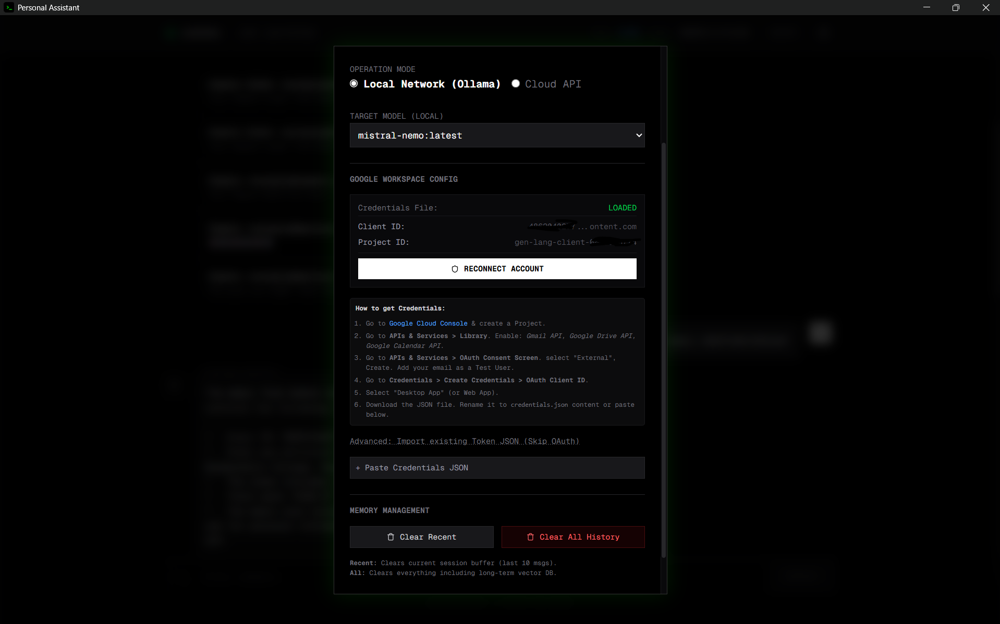

# Aurora: Your Intelligent Local AI Workspace

Aurora is a powerful, privacy-first AI agent designed to run locally on your machine. By leveraging the Model Context Protocol (MCP) and local LLMs via Ollama, Aurora integrates seamlessly with your digital life—managing emails, organizing files, and scheduling events—without your data ever leaving your device.

## 🎥 See Aurora in action

<video controls src="demo/main-demo.mp4" width="100%"></video>

---

## ✨ Key Features

### 🔒 **Privacy-First & Local**
-   **Local Intelligence**: Powered by `Ollama` running `mistral-nemo` (or your model of choice). Your prompts and data stay on your machine.
-   **Secure Storage**: Conversational memory and embeddings are stored locally in `ChromaDB`.

### 🛠️ **Extensible Tooling (MCP)**
Aurora uses the Model Context Protocol to connect with various services:
-   **📧 Gmail Agent**: Read, search, and send emails securely.
-   **📅 Calendar Agent**: Manage your schedule, find conflicts, and book events.
-   **📂 Drive Agent**: List, read, and create files in your Google Drive.
-   **🖥️ Local System**: Interact with local files and time settings.
-   **🌐 Browser Control**: (Experimental) Automate web interactions.

### 🧠 **Context-Aware Memory**
- Remembers past interactions and user preferences using vector search (`ChromaDB`).
- Contextual understanding of your tasks across different sessions.

### 🎨 **Modern Interface**
-   Beautiful, responsive web UI built with **Next.js 14**, **Tailwind CSS**, and **Framer Motion**.
-   Real-time streaming responses.
-   "App Mode" support for a native-like experience.

### ⚙️ Configuration



Aurora offers a flexible configuration menu to tailor the agent to your needs:

| Option | Description |
| :--- | :--- |
| **Agent Name** | Custom name for your assistant (e.g., "Jarvis", "Aurora"). |
| **Model** | Choose the underlying LLM. Supports local models (e.g., `mistral-nemo`, `llama3`) via Ollama or cloud models. |
| **Mode** | Switch between **Local** (runs on your machine via Ollama) or **Cloud** (uses OpenAI/Anthropic/Gemini APIs). |
| **API Keys** | Enter keys for OpenAI, Anthropic, or Gemini if using Cloud mode. |
| **Show Browser** | (Experimental) Toggle whether the automated browser window is visible during tasks. |
| **Google Services** | One-click button to authenticate and connect your Google account for Gmail, Drive, and Calendar integration. |

---

## 🤖 Available Agents

Aurora orchestrates multiple specialized agents to handle different tasks:

### 📧 Gmail Agent
- **List & Search**: Find emails using powerful path filtering (e.g., "from:boss", "is:unread").
- **Summarize**: Read and summarize the content of multiple emails.
- **Draft & Send**: Compose emails with a review step before sending.

### 📅 Calendar Agent
- **Schedule Management**: List upcoming events and find free slots.
- **Booking**: Create new calendar invites and meetings.

### 📂 Drive Agent
- **File Access**: List and search for files in your Google Drive.
- **Content Retrieval**: Read the content of documents for summarization or analysis.

### 🖥️ Local Agent
- **File System**: Access local files in your workspace.
- **System Info**: Check time and other system details.

### 🌐 Browser Agent
- **Web Search**: Perform Google searches to answer questions.
- **Page Visit**: (Experimental) Visit and extract content from specific URLs.

---

## 🚀 Setup

We provide a universal setup script to get you up and running in seconds. 

**Prerequisites:**
1.  **[Ollama](https://ollama.com/)** installed and running (`ollama serve`).
2.  **Pull the model**: `ollama pull llama3.2` (or your preferred model).

**Run the Setup:**

```bash
./setup.sh
```

This will set up all dependencies and launch the Aurora dashboard.

---

## 🛠️ Manual Setup

If you prefer to set things up manually:

### 1. Backend Setup
```bash
cd backend
python3 -m venv venv
source venv/bin/activate  # On Windows: venv\Scripts\activate

# Install dependencies
pip install -r requirements.txt

# Start the server
python3 main.py
```

### 2. Frontend Setup
```bash
cd frontend

# Install dependencies
npm install

# Start the development server
npm run dev
```

### 3. Start Interface
Run the following to launch the App-like interface:
```bash
./start.sh
```
Or simply visit `http://localhost:3000` in your browser.
